# Private Exchange

A private exchange on Solana: private AMM pools and a private order book.
Balances and trades are encrypted with [Arcium](https://arcium.com) MPC. Token supplies stay public.

Full design: **[architecture.md](architecture.md)**

## What works now

- Sign one message → your browser derives your encryption key (Umbra-style)
- Encrypted token accounts — one per token, readable only by you
- Mint free test USDC into your encrypted balance (30 per click)
- Create your own token — a real SPL mint with supply 0; the full supply goes privately to you
- Create a liquidity pool — reserves stay encrypted; price and a health score are public
- Buy and sell privately — your amount is encrypted, the price moves after every trade
- Earn swap fees as a liquidity provider — paid automatically into your private balance; only you can see how much
- Move tokens to your public wallet — a zero-knowledge proof (made in your browser) shows you have enough without revealing your balance; the program verifies it and sends real SPL tokens (from its vault first, minting the rest)
- Move public tokens in — any SPL token in your wallet (made here or not) goes into the exchange's vault and your private balance
- Private order book — limit, market and post-only orders whose side, price and size stay encrypted; Arcium matches them (best price first, at the waiting order's price), and the other side is settled automatically

Live on **devnet** · program `7DtBhe3Fi46dy6Gp1Mj7FbW9oZD3xzRs2RKXurtmL3VP` · Arcium cluster `456`

## Demo

One run on devnet, start to finish, with two brand-new wallets: **Alice** creates a token, a pool and an
order book; **Bob** trades with her. The numbers are from that run. Click any image to open it full size.

| Step | Screenshot |
|---|---|
| **1. Home** — Your private balances on top, live pools and order books below. A pool shows only its price and a health score: its reserves are encrypted. | <a href="docs/screenshots/01-home.jpg">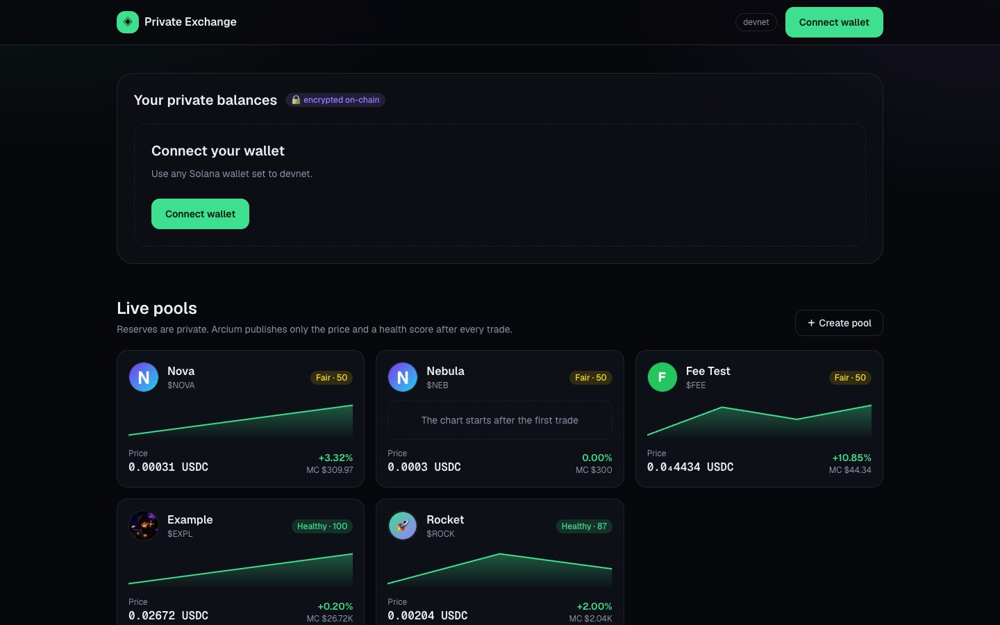</a> |
| **2. Connect a wallet** — Any Solana wallet on devnet (Phantom, Solflare, Backpack…). This run used a throwaway test wallet. | <a href="docs/screenshots/02-connect-wallet.jpg">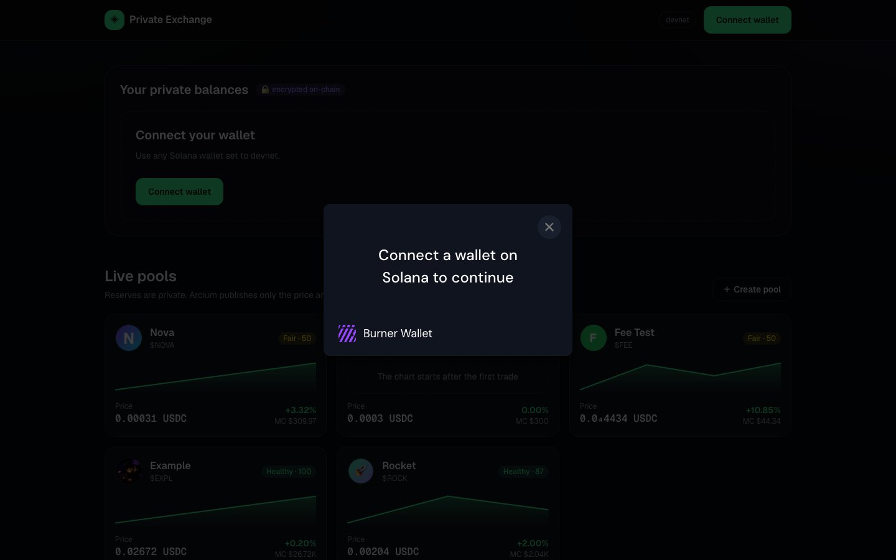</a> |
| **3. Create your private account** — Connecting also asks you to sign one message, `private exchange on solana`. Your browser turns that signature into an encryption key (x25519, Umbra-style): same wallet, same key, nothing stored. One transaction saves the public half on-chain. | <a href="docs/screenshots/03-create-account.jpg">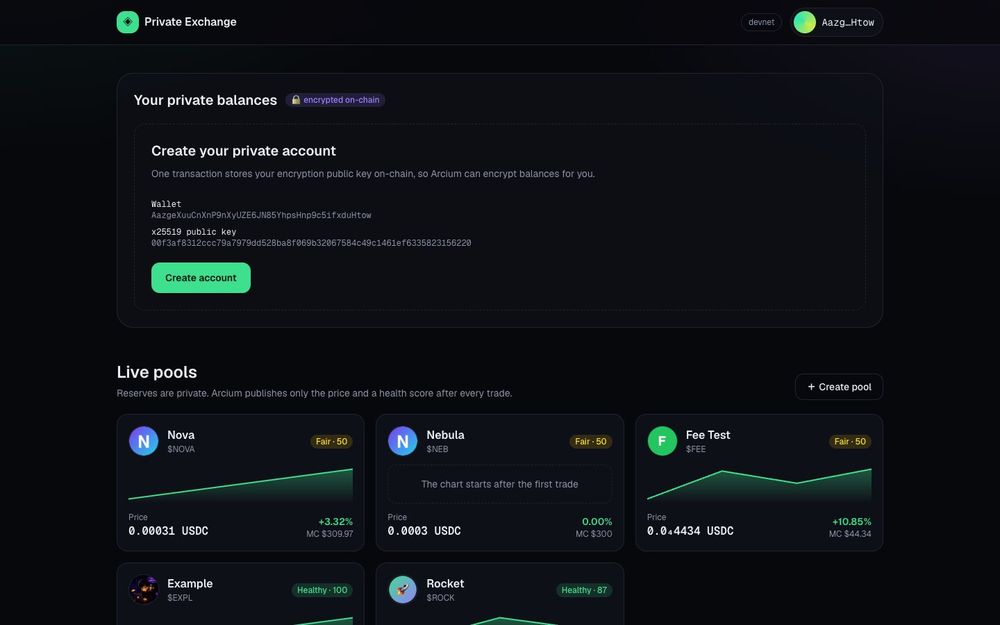</a> |
| **4. Private balance** — *Mint 30 USDC* adds free test USDC. Arcium adds it to your encrypted balance, and only your browser can decrypt the number. The minted amount is public; the balance is not. | <a href="docs/screenshots/04-private-balance.jpg">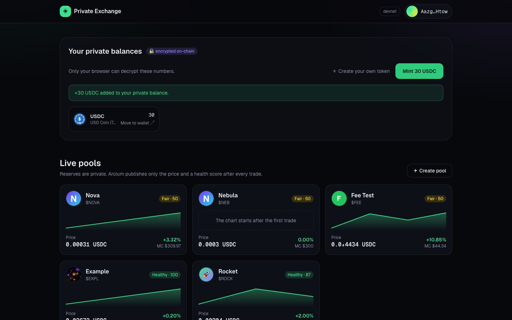</a> |
| **5. Menu** — Create a token, a liquidity pool or an order book. | <a href="docs/screenshots/05-menu.jpg">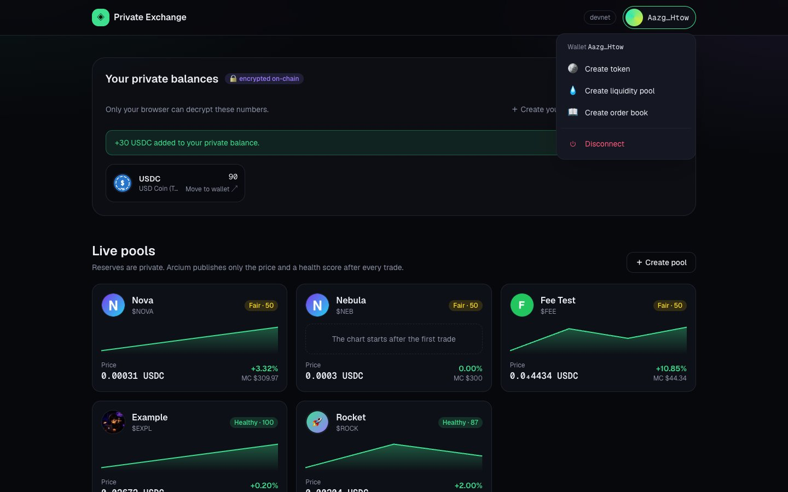</a> |
| **6. Create a token** — Name, symbol, logo and supply. The logo and metadata go to IPFS. | <a href="docs/screenshots/06-create-token.jpg">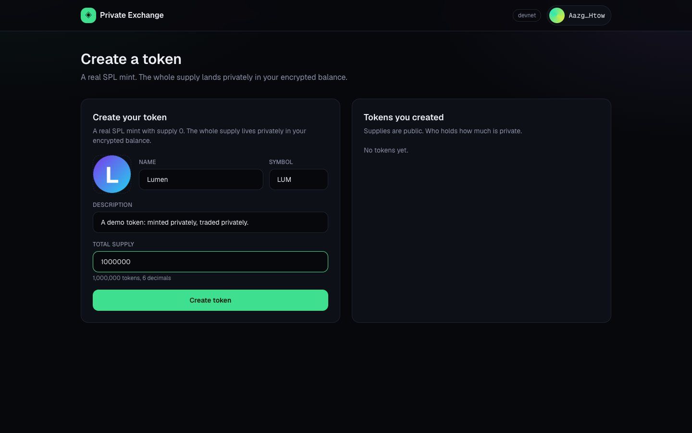</a> |
| **7. Token created** — A real SPL mint (Token-2022) with SPL supply 0: all 1,000,000 LUM land in Alice's encrypted balance. Supplies stay public (private + public = total); who holds how much does not. | <a href="docs/screenshots/07-token-created.jpg">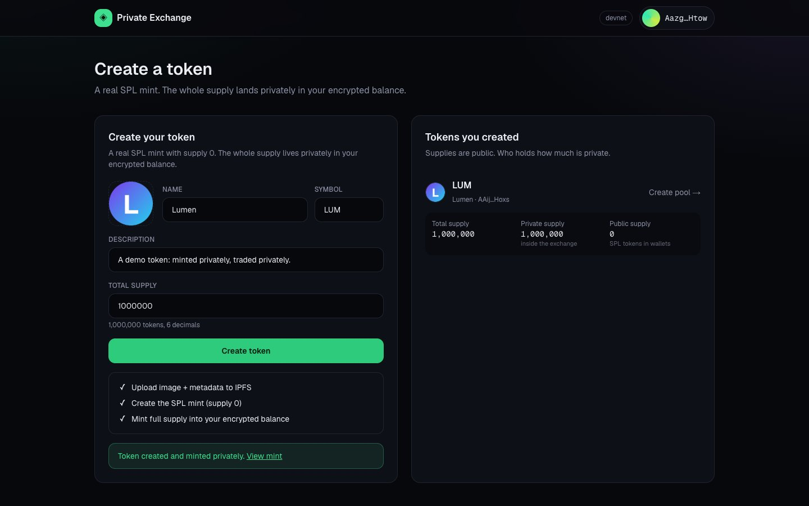</a> |
| **8. Create a liquidity pool** — 200,000 LUM + 60 USDC sets the starting price (0.0003). The deposit is encrypted in the browser and Arcium moves it, so the reserves stay hidden. Health is a coarse public score. Alice picks a 1% fee, paid to LP holders. | <a href="docs/screenshots/08-create-pool.jpg">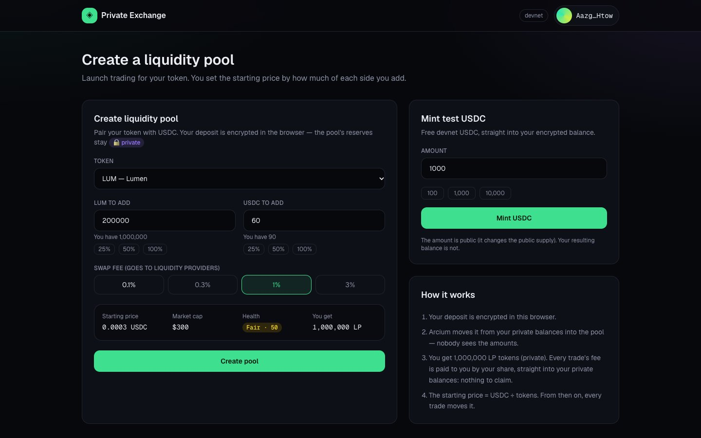</a> |
| **9. Pool page** — Public: price, supplies, fee, trades, health. Hidden: the reserves. *Your liquidity* is readable only by Alice: her LP share and the swap fees she has earned. | <a href="docs/screenshots/09-pool-page.jpg">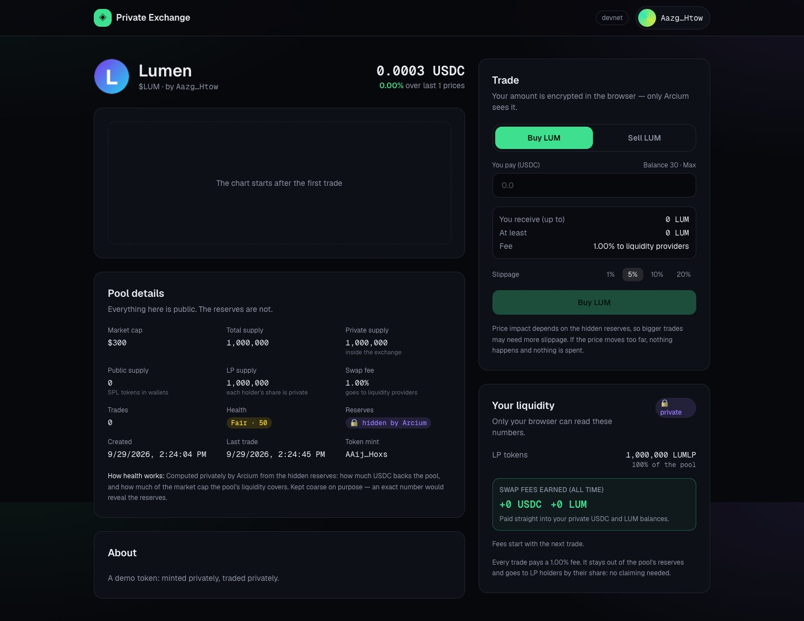</a> |
| **10. Buy privately (Bob)** — Bob's amount and slippage range are encrypted in his browser. Arcium pays the best amount in that range that keeps x·y = k: 3,238.13 LUM for 1 USDC. | <a href="docs/screenshots/10-buy.jpg">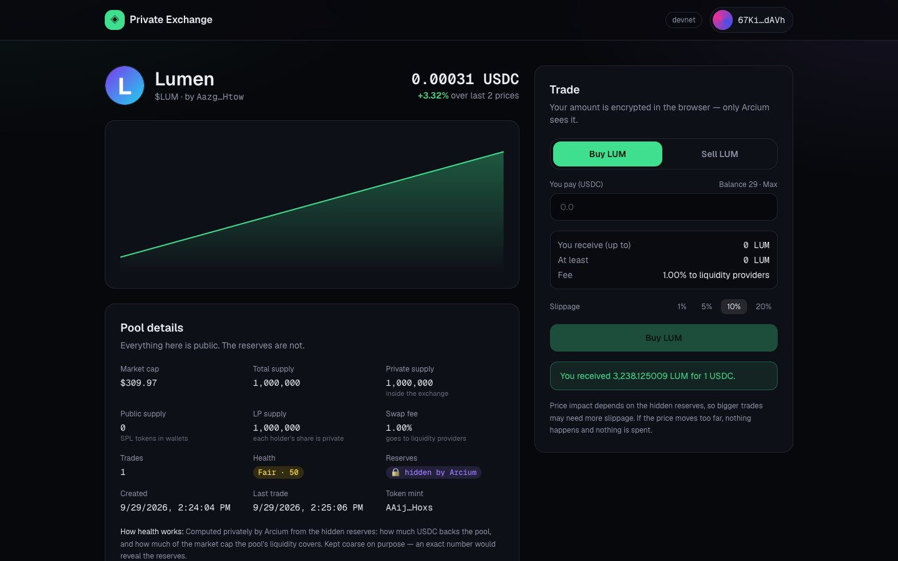</a> |
| **11. Sell privately (Bob)** — Same for selling: 2,000 LUM for 0.61 USDC. The chain only sees that a trade happened, and the new price. | <a href="docs/screenshots/11-sell.jpg">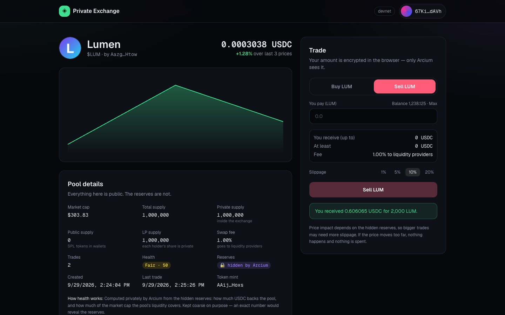</a> |
| **12. LP fees, paid automatically (Alice)** — Each trade's fee stays out of the reserves. Once trading pauses, the backend sends a payout and Arcium adds Alice's share straight into her private balances: +0.01 USDC and +20.02 LUM. She gets a notification, and *Swap fees earned* shows her lifetime total, readable only by her. Nothing to claim. | <a href="docs/screenshots/12-lp-fees.jpg">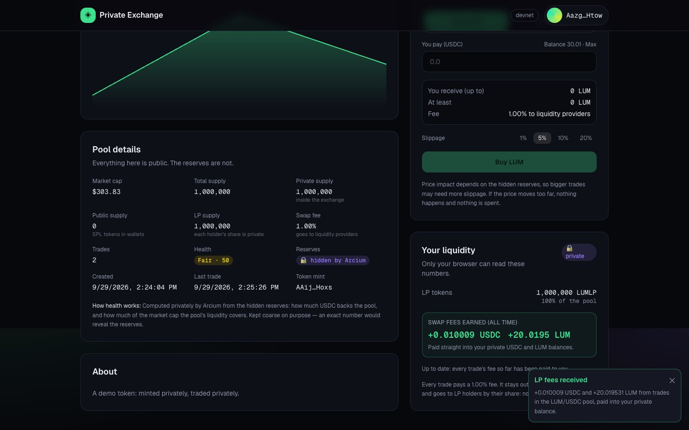</a> |
| **13. Portfolio** — USDC, LUM and the LP token with its fees. LP tokens stay private: they can't move to a wallet. | <a href="docs/screenshots/13-portfolio.jpg">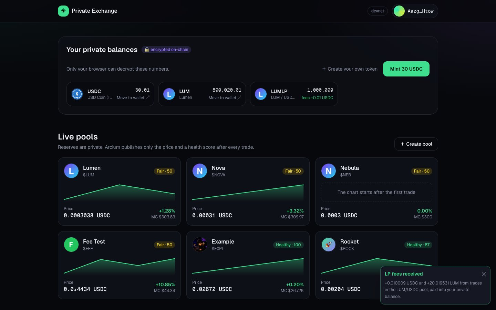</a> |
| **14. Private order book** — Alice opens a LUM/USDC book. Limit, market (fills now, up to a slippage limit) and post-only (only waits in the book) orders. Side, price and size are encrypted; Arcium matches them. | <a href="docs/screenshots/14-order-book.jpg">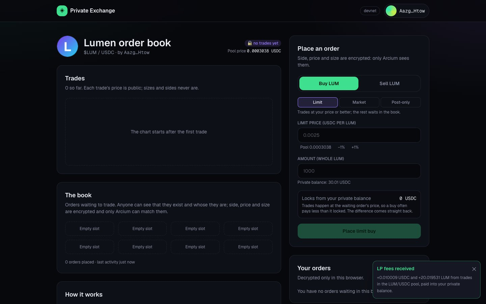</a> |
| **15. Limit order (Alice)** — Sell 2,000 LUM at 0.00032. The tokens are locked inside her encrypted balance. Everyone sees a *Hidden order* and who placed it; *Your orders* is decrypted only in her browser. | <a href="docs/screenshots/15-limit-sell.jpg">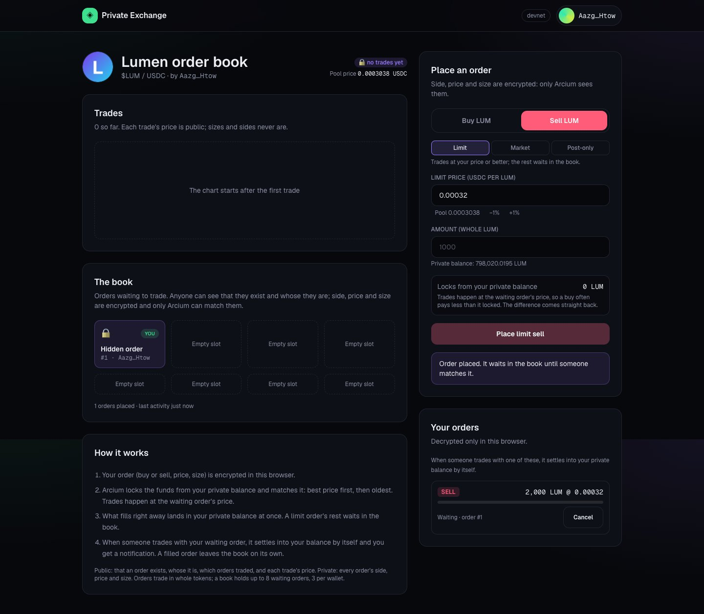</a> |
| **16. The order fills (Bob)** — Bob buys 1,000 at 0.00032. Arcium matches it with Alice's order at her price and pays Bob at once. Public: that her order traded, and the price. Never the size or the side. | <a href="docs/screenshots/16-order-fills.jpg">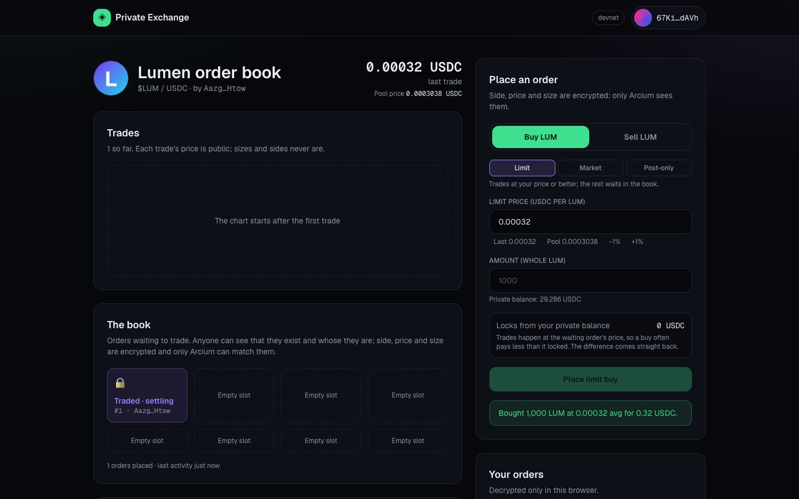</a> |
| **17. Fill notification (Alice)** — The backend settles traded orders by itself, so Alice clicks nothing: +0.32 USDC lands in her balance, she gets a notification, and her order shows *Filled 1,000 of 2,000*. | <a href="docs/screenshots/17-fill-notification.jpg">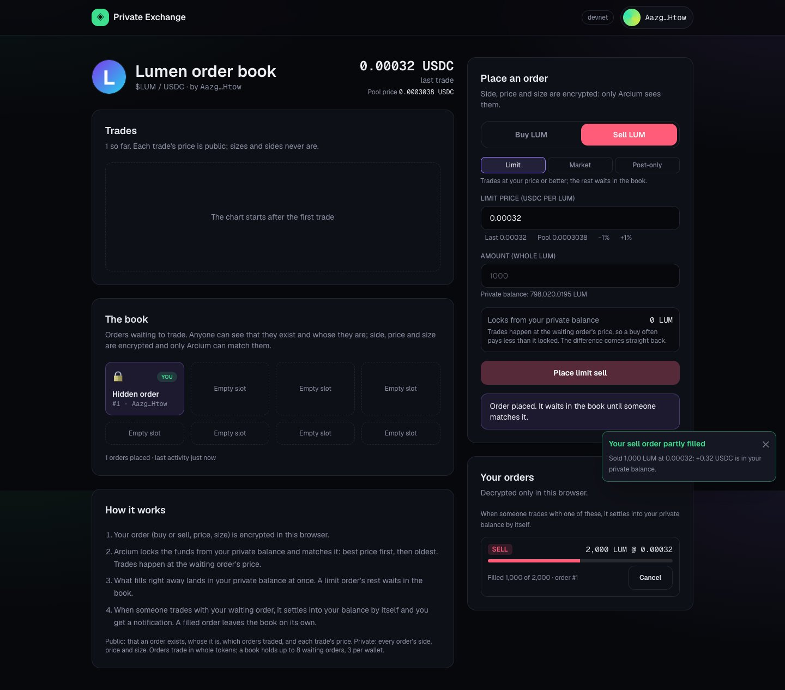</a> |
| **18. Move to wallet: zero-knowledge proof** — Arcium fingerprints Alice's balance (SHA3 of the balance and a secret salt). Her browser then proves "balance ≥ 10,000" with a Groth16 proof, without revealing the balance. | <a href="docs/screenshots/18-zk-proof.jpg">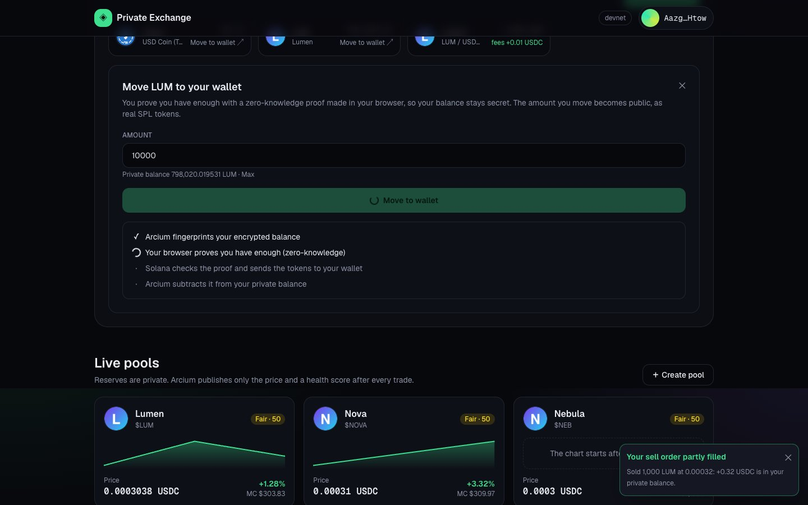</a> |
| **19. Real SPL tokens in the wallet** — The program checks the proof on-chain and sends 10,000 LUM to her wallet (from the exchange's vault first, minting only the rest). Arcium subtracts them from her private balance. They now show under *In your public wallet*. | <a href="docs/screenshots/19-in-wallet.jpg">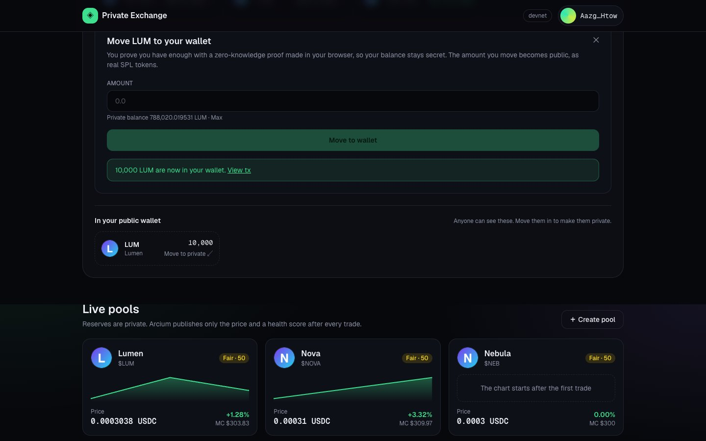</a> |
| **20. Move to private (the vault)** — Public tokens come back without being burned: 4,000 LUM go into the exchange's vault and Arcium adds them to her encrypted balance. Later moves out pay from the vault first. | <a href="docs/screenshots/20-move-to-private.jpg">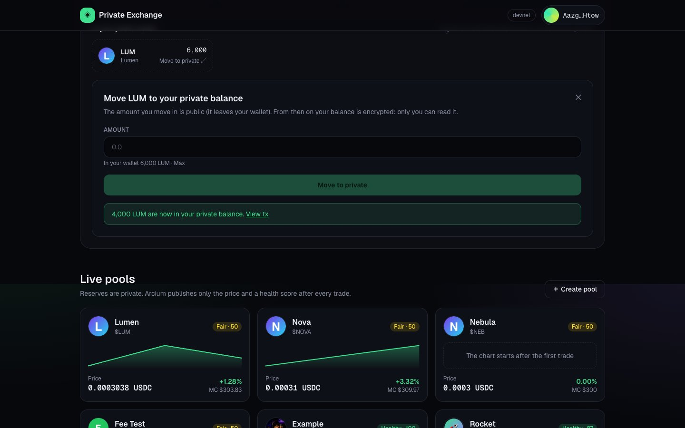</a> |
| **21. Tokens from outside** — Any SPL token works, even one this exchange didn't create: *Outside Coin* (OUT), made with the Solana CLI. It is listed once, then 200 OUT move in through its vault. Moving out pays only from the vault; it is never minted here. | <a href="docs/screenshots/21-outside-token.jpg">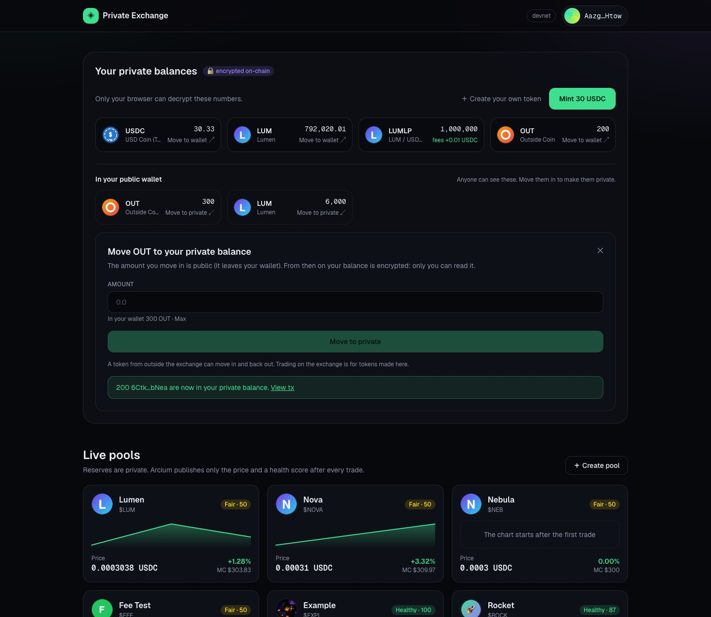</a> |
| **22. 404** — Unknown pages show a way back. | <a href="docs/screenshots/22-not-found.jpg">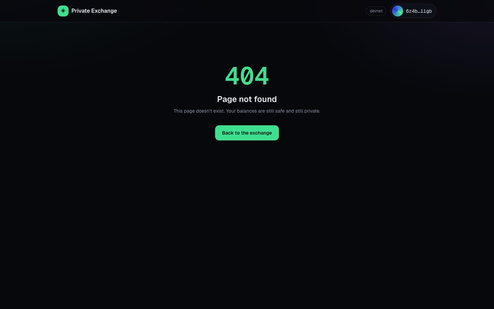</a> |

## Repo

| Folder                     | What                                                 |
| -------------------------- | ---------------------------------------------------- |
| `private_solana_exchange/` | Solana program (Anchor) + Arcium MPC circuits        |
| `frontend/`                | Next.js app                                          |
| `backend/`                 | API — IPFS uploads (Pinata), account index (MongoDB), settler (order fills + LP fees) |
| `zk/`                      | ZK circuit for "move to wallet" (circom + snarkjs)   |

## Run it

```bash
cd backend && cp .env.example .env   # fill in MongoDB + Pinata
npm install && npm run dev           # http://localhost:4000
```

```bash
cd frontend && npm install && npm run dev   # http://localhost:3000
```

`npm run check-index` (in `backend/`) compares the index with the chain, account by account.

Set your wallet to **devnet** and connect. The home page is your trading panel;
the profile menu (top right) has **Create token**, **Create liquidity pool** and **Create order book**.

## Deploy

**Frontend → Vercel.** Import the repo and set **Root Directory = `frontend`** (`frontend/vercel.json`
does the rest). Env vars: `NEXT_PUBLIC_RPC_URL`, `NEXT_PUBLIC_PROGRAM_ID`,
`NEXT_PUBLIC_ARCIUM_CLUSTER_OFFSET`, `NEXT_PUBLIC_BACKEND_URL`.

**Backend → an always-on host** (Render, Railway, Fly), not Vercel: the indexer keeps a
websocket open and the settler (order fills, LP fee payouts) runs a loop, which serverless functions can't. Env vars as
in `backend/.env.example`; add the Vercel URL to `CORS_ORIGIN` (comma-separated) and give
`SETTLER_KEYPAIR` a wallet with a little devnet SOL. A dedicated RPC (e.g. Helius free tier)
avoids public-RPC rate limits.

## Program development

```bash
cd private_solana_exchange
arcium build        # circuit + program
arcium test         # local validator + Arcium nodes (needs Docker)
npm run sync-idl    # copy the IDL into frontend + backend
```

One-time devnet setup after a deploy: see `scripts/setup-devnet.ts`.

## ZK circuit

```bash
cd zk && npm install
npm run build    # compile + local trusted setup (first run ~45 min)
npm test         # the circuit accepts real withdrawals and rejects cheats
npm run export   # verifying key → program, prover files → frontend/public/zk
```

The prover files the browser needs are committed in `frontend/public/zk` (the 82 MB proving key
in two parts, joined and hash-checked in the browser). A new setup means a new verifying key, so
the program must be rebuilt and redeployed after it.
